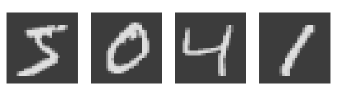
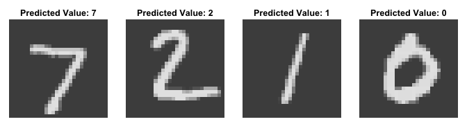

<!-- README.md is generated from README.Rmd. Please edit that file -->

# scorcher: Blazing a trail for effortless model building with torch in R

<!-- badges: start -->

<!-- badges: end -->

### 

### Overview

The `scorcher` package provides high-level functionality for building
and fitting deep learning models using the Torch library in R. By
simplifying model development through easy-to-use functions and ensuring
compatibility with existing R workflows and data structures, scorcher
facilitates the use of deep learning without the need for extensive
programming knowledge.

The package allows users to create, modify, and visualize models through
functions such as `initiate_scorch`, `scorch_layer`, `compile_scorch`,
and `fit_scorch`. The package flexibly handles tasks such as prediction,
classification, computer vision, diffusion, and more.

### Installation

You can install the development version of scorcher from
[GitHub](https://github.com/) with:

``` r
# install.packages("pak")
pak::pak("jtleek/scorcher")
```

### Getting Started

``` r
library(scorcher)
```

#### Example: Classifying MNIST Images

Here is an example where we build a convolutional neural network using
the
[MNIST](https://github.com/mlverse/torchvision/blob/main/R/dataset-mnist.R)
dataset, which contains 70,000 grayscale images of handwritten digits,
from 0 to 9. The goal is to classify these images into one of the 10
digit categories (0-9).

**1. Prepare the Training Data:**

``` r
library(torch)
library(torchvision)
```

``` r
#- Training Data

train_data <- mnist_dataset(
  root = tempdir(),
  download = TRUE,
  transform = transform_to_tensor)

x_train <- torch_tensor(train_data$data, dtype = torch_float()) |> 
  torch_unsqueeze(2)

y_train <- torch_tensor(train_data$targets, dtype = torch_long())
```

**Example Training Images:**



#### Defining the Neural Network

Next, we’ll define our neural network using the `scorcher` package.

**2. Create the Dataloader:**

``` r
#- Create the Dataloader

dl <- scorch_create_dataloader(x_train, y_train, batch_size = 500)
```

**3. Define the Scorcher Model:**

``` r
#- Define the Neural Network

scorch_model <- initiate_scorch(dl) |>
  scorch_input("x") |>
  scorch_layer("conv1", "conv2d", in_channels = 1, out_channels = 32, kernel_size = 3) |>
  scorch_layer("act1", "relu") |>
  scorch_layer("conv2", "conv2d", in_channels = 32, out_channels = 64, kernel_size = 3) |>
  scorch_layer("act2", "relu") |>
  scorch_layer("pool1", "max_pool2d", kernel_size = 2) |>
  scorch_dropout("drop1", p = 0.25) |>
  scorch_flatten("flat1") |>
  scorch_layer("fc1", "linear", in_features = 9216, out_features = 128) |>
  scorch_layer("act3", "relu") |>
  scorch_layer("fc2", "linear", in_features = 128, out_features = 10) |>
  scorch_output("fc2")
```

Node names (like `"conv1"`, `"fc1"`) are unique identifiers that wire
the computation graph – they let nodes reference each other for
branching, fusion, and skip connections. See `vignette("scorch_layer")`
for naming conventions.

**4. Compile the Model:**

``` r
#- Compile the Neural Network

scorch_model <- scorch_model |>
  compile_scorch(
    loss_fn          = nn_cross_entropy_loss(),
    optimizer_fn     = optim_adam,
    optimizer_params = list(lr = 0.001)
  )
```

**5. Train the Model**

``` r
#-- Training the Neural Network

scorch_model <- scorch_model |>
  fit_scorch(num_epochs = 10, verbose = TRUE)
```

**6. Evaluate the Model**

Finally, we’ll evaluate our model on the testing data.

``` r
#- Testing Data

test_data <- mnist_dataset(
  root = tempdir(),
  train = FALSE,
  transform = transform_to_tensor
)

x_test <- torch_tensor(test_data$data, dtype = torch_float()) |> 
  torch_unsqueeze(2)

y_test <- torch_tensor(test_data$targets, dtype = torch_long())

#- Model Predictions

scorch_model$nn_model$eval()

pred <- scorch_model$nn_model(x_test) |> torch_argmax(dim = 2)

accuracy <- sum(pred == y_test)$item() / length(y_test)

cat(sprintf("Testing Accuracy: %.2f%%\n", accuracy * 100))
#> Testing Accuracy: 98.59%
```

**Example Predictions Images:**



### Contributing

Contributions are welcome! Please open an issue or submit a pull request
on GitHub.

### License

This project is licensed under the MIT License.
